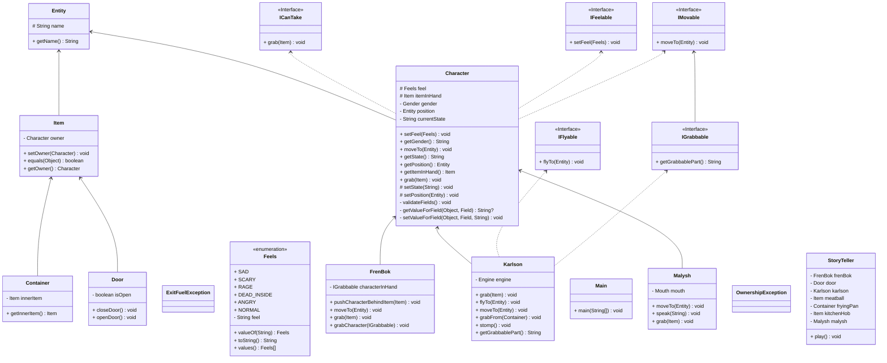

## Выполнял
**ФИ:** Зинченко Иван

**ИСУ:** 408657

**Вариант:** ~528475.3

_Так как на se.ifmo сбросились варианты я взял текст напрямую из сказки._

## Задание

> У Карлсона дрогнули губы, и он надулся. Он сделал шаг к плите и взял со сковородки одну тефтельку. 
> Вот этого ему не следовало делать. Фрекен Бок взревела от бешенства и кинулась на Карлсона, схватила его за шиворот 
> и вытолкнула за дверь. Малыш был просто в отчаянии. Больше он ничего не успел сказать, потому что дверь кухни 
> распахнулась и ворвался Карлсон, тоже злой как чёрт. Он подлетел к Фрекен Бок и топнул ногой об пол.

## Вывод программы
```
Кралсон дрогнул губой
Кралсон надулся
Он сделал шаг к плита
Предмет тефтелька принадлежит Фрекен Бок, а не Кралсон
Вот этого ему не следовало делать
Фрекен Бок взревела от бешенства
Она кинулась к Кралсон
Она схватила Кралсон за шиворот
Она вытолкнула Кралсон за Дверь
Малыш был просто в отчаянии
Он ничего не сказал
Дверь распахнулась
Он сделал шаг к Дверь
Кралсон злой как чёрт
Он подлетел к Фрекен Бок
Кралсон топнул ногой
```

## Структура проекта

Главный абстрактный класс - Entity, который имеет только имя. От него наследуются предметы и персонажи. 
Персонажи могут чувствовать *(IFeelabe)*, двигаться *(IMovable)* и брать вещи *(ITakeable)*. 
Также персонажи имеют гендер *(enum Feels)*.

За историю отвечает класс *StoryTeller*. Он меняет состояние персонажей и отображает их состояние.

## UML диаграмма


## Особенности 4 лабы
Есть два исключения: `OwnershipException` и `ExitFuelException`. `OwnershipException` - исключение при взятии чужой вещи.
`ExitFuelException` возникает, когда у Карлсона кончается топливо.

Есть вложенный статический класс `Engin` у Карлсона, отвечающий за его движок. В нём есть локальный класс `Path`, хранящий
в себе дистанцию полёта и формулу расчёта расхода. Для формулы используются анонимные классы интерфейса `IntFormula`.
Есть вложенный не статический класс `Mouth` у Малыша, который отвечает за его речь.